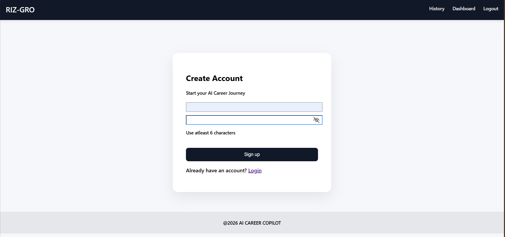
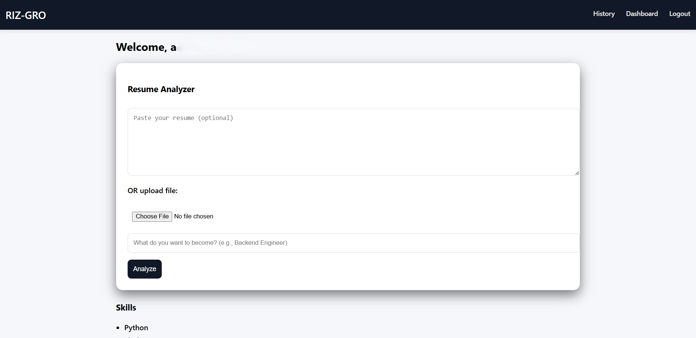
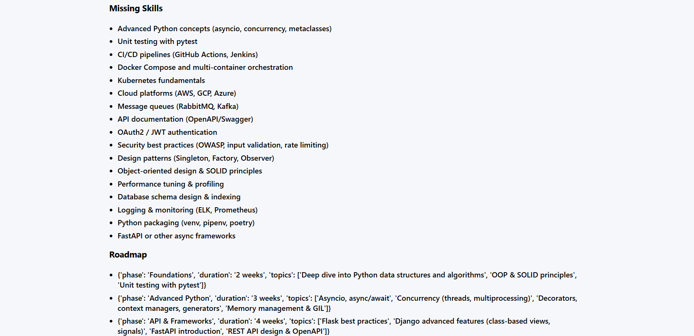
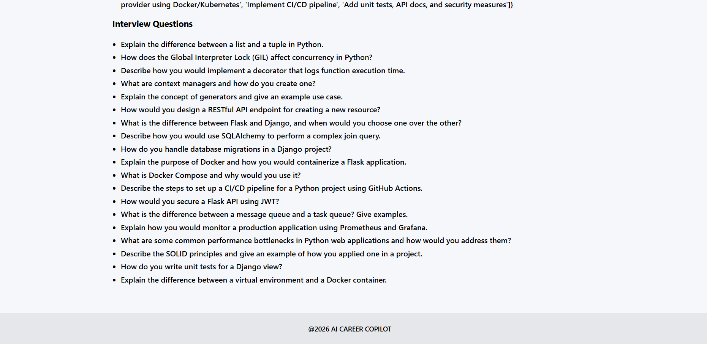

# Resume Analyzer

A Flask web app that uses the Groq API to review a resume against a target role. It extracts relevant skills, identifies missing skills, creates a learning roadmap, and generates interview questions.

## Features

- Create an account and sign in
- Paste resume text or upload a PDF or DOCX file
- Analyze a resume for a target career role
- View relevant skills, skill gaps, a roadmap, and interview questions
- Save analysis reports and review them later in history
- Use SQLite by default, with a configurable SQLAlchemy database URL

## Screenshots

### Sign Up



### Resume Analysis Dashboard



### Analysis Result






## Requirements

- Python 3.10 or newer
- A Groq API key

## Setup

1. Clone the repository and open its directory:

   ```bash
   git clone https://github.com/<your-username>/<your-repository>.git
   cd <your-repository>
   ```

2. Create and activate a virtual environment:

   ```bash
   python -m venv .venv
   ```

   On Windows PowerShell:

   ```powershell
   .\.venv\Scripts\Activate.ps1
   ```

   On macOS or Linux:

   ```bash
   source .venv/bin/activate
   ```

3. Install dependencies:

   ```bash
   pip install -r requirements.txt
   ```

4. Create a local environment file:

   ```bash
   Copy-Item .env.example .env
   ```

   Replace the placeholder values in `.env`:

   ```dotenv
   FLASK_SECRET_KEY=use-a-long-random-secret
   GROQ_API_KEY=your-groq-api-key
   DATABASE_URL=sqlite:///career.db
   ```

   Generate a secret key with:

   ```bash
   python -c "import secrets; print(secrets.token_urlsafe(32))"
   ```

5. Start the application:

   ```bash
   python app.py
   ```

6. Open `http://127.0.0.1:5000` in your browser.

## Configuration

| Variable           | Required | Description                                       |
| ------------------ | -------- | ------------------------------------------------- |
| `FLASK_SECRET_KEY` | Yes      | Secret used to sign Flask sessions                |
| `GROQ_API_KEY`     | Yes      | API key used for resume analysis                  |
| `DATABASE_URL`     | Yes      | SQLAlchemy database URL; SQLite is the default    |
| `DATABASE_SSL_CA`  | No       | CA certificate path for databases that require it |

## Project Structure

```text
.
├── ai.py                 # Groq API integration and analysis prompt
├── app.py                # Flask routes and file handling
├── db.py                 # SQLAlchemy engine and session setup
├── models.py             # User and report models
├── requirements.txt      # Python dependencies
├── static/               # Stylesheets and other static assets
└── templates/            # Jinja HTML templates
```


